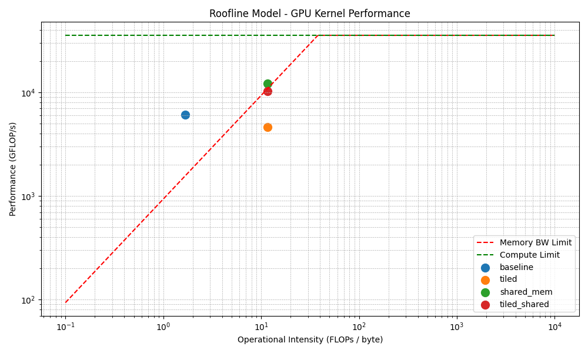

# madmax
build a pipeline with profiling and tooling to demonstrate gpu optimization workflow

Running kernel: baseline
==PROF== Connected to process 268877 (/home/dako/miniconda3/bin/python3.12)
==PROF== Profiling "baseline_add" - 0: 0%....50%....100% - 8 passes
Runtime: 701.808 ms, Throughput: 0.02 GB/s
Running kernel: tiled
==PROF== Profiling "tiled_add" - 1: 0%....50%....100% - 8 passes
Runtime: 101.137 ms, Throughput: 0.12 GB/s
Running kernel: shared_mem
==PROF== Profiling "shared_mem_add" - 2: 0%....50%....100% - 8 passes
Runtime: 99.968 ms, Throughput: 0.12 GB/s
Running kernel: tiled_shared
==PROF== Profiling "tiled_shared_add" - 3: 0%....50%....100% - 8 passes
Runtime: 85.694 ms, Throughput: 0.14 GB/s
==PROF== Disconnected from process 268877
[268877] python3.12@127.0.0.1
  baseline_add(float *, float *, float *, int) (3907, 1, 1)x(256, 1, 1), Context 1, Stream 7, Device 0, CC 8.6
    Section: GPU Speed Of Light Throughput
    ----------------------- ----------- ------------
    Metric Name             Metric Unit Metric Value
    ----------------------- ----------- ------------
    DRAM Frequency                  Ghz         9.47
    SM Frequency                    Ghz         1.38
    Elapsed Cycles                cycle       20,929
    Memory Throughput                 %        79.78
    DRAM Throughput                   %        79.78
    Duration                         us        15.07
    L1/TEX Cache Throughput           %        22.46
    L2 Cache Throughput               %        38.46
    SM Active Cycles              cycle    14,881.71
    Compute (SM) Throughput           %        17.16
    ----------------------- ----------- ------------

    OPT   Memory is more heavily utilized than Compute: Look at the Memory Workload Analysis section to identify the    
          DRAM bottleneck. Check memory replay (coalescing) metrics to make sure you're efficiently utilizing the       
          bytes transferred. Also consider whether it is possible to do more work per memory access (kernel fusion) or  
          whether there are values you can (re)compute.                                                                 

    Section: Launch Statistics
    -------------------------------- --------------- ---------------
    Metric Name                          Metric Unit    Metric Value
    -------------------------------- --------------- ---------------
    Block Size                                                   256
    Function Cache Configuration                     CachePreferNone
    Grid Size                                                  3,907
    Registers Per Thread             register/thread              16
    Shared Memory Configuration Size           Kbyte            8.19
    Driver Shared Memory Per Block       Kbyte/block            1.02
    Dynamic Shared Memory Per Block       byte/block               0
    Static Shared Memory Per Block        byte/block               0
    # SMs                                         SM              82
    Stack Size                                                 1,024
    Threads                                   thread       1,000,192
    # TPCs                                                        41
    Enabled TPC IDs                                              all
    Uses Green Context                                             0
    Waves Per SM                                                7.94
    -------------------------------- --------------- ---------------

    Section: Occupancy
    ------------------------------- ----------- ------------
    Metric Name                     Metric Unit Metric Value
    ------------------------------- ----------- ------------
    Block Limit SM                        block           16
    Block Limit Registers                 block           16
    Block Limit Shared Mem                block            8
    Block Limit Warps                     block            6
    Theoretical Active Warps per SM        warp           48
    Theoretical Occupancy                     %          100
    Achieved Occupancy                        %        80.47
    Achieved Active Warps Per SM           warp        38.62
    ------------------------------- ----------- ------------

    OPT   Est. Local Speedup: 19.53%                                                                                    
          The difference between calculated theoretical (100.0%) and measured achieved occupancy (80.5%) can be the     
          result of warp scheduling overheads or workload imbalances during the kernel execution. Load imbalances can   
          occur between warps within a block as well as across blocks of the same kernel. See the CUDA Best Practices   
          Guide (https://docs.nvidia.com/cuda/cuda-c-best-practices-guide/index.html#occupancy) for more details on     
          optimizing occupancy.                                                                                         

    Section: GPU and Memory Workload Distribution
    -------------------------- ----------- ------------
    Metric Name                Metric Unit Metric Value
    -------------------------- ----------- ------------
    Average DRAM Active Cycles       cycle      113,828
    Total DRAM Elapsed Cycles        cycle    1,712,128
    Average L1 Active Cycles         cycle    14,881.71
    Total L1 Elapsed Cycles          cycle    1,457,258
    Average L2 Active Cycles         cycle    14,338.83
    Total L2 Elapsed Cycles          cycle      985,584
    Average SM Active Cycles         cycle    14,881.71
    Total SM Elapsed Cycles          cycle    1,457,258
    Average SMSP Active Cycles       cycle    14,937.74
    Total SMSP Elapsed Cycles        cycle    5,829,032
    -------------------------- ----------- ------------

  tiled_add(float *, float *, float *, int) (1024, 1, 1)x(256, 1, 1), Context 1, Stream 7, Device 0, CC 8.6
    Section: GPU Speed Of Light Throughput
    ----------------------- ----------- ------------
    Metric Name             Metric Unit Metric Value
    ----------------------- ----------- ------------
    DRAM Frequency                  Ghz         9.44
    SM Frequency                    Ghz         1.36
    Elapsed Cycles                cycle       22,733
    Memory Throughput                 %        74.82
    DRAM Throughput                   %        74.82
    Duration                         us        16.54
    L1/TEX Cache Throughput           %        23.08
    L2 Cache Throughput               %        35.03
    SM Active Cycles              cycle    15,653.98
    Compute (SM) Throughput           %        13.08
    ----------------------- ----------- ------------

    OPT   Memory is more heavily utilized than Compute: Look at the Memory Workload Analysis section to identify the    
          DRAM bottleneck. Check memory replay (coalescing) metrics to make sure you're efficiently utilizing the       
          bytes transferred. Also consider whether it is possible to do more work per memory access (kernel fusion) or  
          whether there are values you can (re)compute.                                                                 

    Section: Launch Statistics
    -------------------------------- --------------- ---------------
    Metric Name                          Metric Unit    Metric Value
    -------------------------------- --------------- ---------------
    Block Size                                                   256
    Function Cache Configuration                     CachePreferNone
    Grid Size                                                  1,024
    Registers Per Thread             register/thread              26
    Shared Memory Configuration Size           Kbyte            8.19
    Driver Shared Memory Per Block       Kbyte/block            1.02
    Dynamic Shared Memory Per Block       byte/block               0
    Static Shared Memory Per Block        byte/block               0
    # SMs                                         SM              82
    Stack Size                                                 1,024
    Threads                                   thread         262,144
    # TPCs                                                        41
    Enabled TPC IDs                                              all
    Uses Green Context                                             0
    Waves Per SM                                                2.08
    -------------------------------- --------------- ---------------

    OPT   Est. Speedup: 33.33%                                                                                          
          A wave of thread blocks is defined as the maximum number of blocks that can be executed in parallel on the    
          target GPU. The number of blocks in a wave depends on the number of multiprocessors and the theoretical       
          occupancy of the kernel. This kernel launch results in 2 full waves and a partial wave of 41 thread blocks.   
          Under the assumption of a uniform execution duration of all thread blocks, this partial wave may account for  
          up to 33.3% of the total runtime of this kernel. Try launching a grid with no partial wave. The overall       
          impact of this tail effect also lessens with the number of full waves executed for a grid. See the Hardware   
          Model (https://docs.nvidia.com/nsight-compute/ProfilingGuide/index.html#metrics-hw-model) description for     
          more details on launch configurations.                                                                        

    Section: Occupancy
    ------------------------------- ----------- ------------
    Metric Name                     Metric Unit Metric Value
    ------------------------------- ----------- ------------
    Block Limit SM                        block           16
    Block Limit Registers                 block            8
    Block Limit Shared Mem                block            8
    Block Limit Warps                     block            6
    Theoretical Active Warps per SM        warp           48
    Theoretical Occupancy                     %          100
    Achieved Occupancy                        %        87.17
    Achieved Active Warps Per SM           warp        41.84
    ------------------------------- ----------- ------------

    OPT   Est. Local Speedup: 12.83%                                                                                    
          The difference between calculated theoretical (100.0%) and measured achieved occupancy (87.2%) can be the     
          result of warp scheduling overheads or workload imbalances during the kernel execution. Load imbalances can   
          occur between warps within a block as well as across blocks of the same kernel. See the CUDA Best Practices   
          Guide (https://docs.nvidia.com/cuda/cuda-c-best-practices-guide/index.html#occupancy) for more details on     
          optimizing occupancy.                                                                                         

    Section: GPU and Memory Workload Distribution
    -------------------------- ----------- ------------
    Metric Name                Metric Unit Metric Value
    -------------------------- ----------- ------------
    Average DRAM Active Cycles       cycle      116,844
    Total DRAM Elapsed Cycles        cycle    1,873,920
    Average L1 Active Cycles         cycle    15,653.98
    Total L1 Elapsed Cycles          cycle    1,558,304
    Average L2 Active Cycles         cycle    15,258.81
    Total L2 Elapsed Cycles          cycle    1,082,064
    Average SM Active Cycles         cycle    15,653.98
    Total SM Elapsed Cycles          cycle    1,558,304
    Average SMSP Active Cycles       cycle    15,583.54
    Total SMSP Elapsed Cycles        cycle    6,233,216
    -------------------------- ----------- ------------

    OPT   Est. Speedup: 6.173%                                                                                          
          One or more SMs have a much lower number of active cycles than the average number of active cycles. Maximum   
          instance value is 7.49% above the average, while the minimum instance value is 9.90% below the average.       
    ----- --------------------------------------------------------------------------------------------------------------
    OPT   Est. Speedup: 6.136%                                                                                          
          One or more SMSPs have a much lower number of active cycles than the average number of active cycles. Maximum 
          instance value is 7.48% above the average, while the minimum instance value is 10.68% below the average.      
    ----- --------------------------------------------------------------------------------------------------------------
    OPT   Est. Speedup: 6.173%                                                                                          
          One or more L1 Slices have a much lower number of active cycles than the average number of active cycles.     
          Maximum instance value is 7.49% above the average, while the minimum instance value is 9.90% below the        
          average.                                                                                                      

  shared_mem_add(float *, float *, float *, int) (3907, 1, 1)x(256, 1, 1), Context 1, Stream 7, Device 0, CC 8.6
    Section: GPU Speed Of Light Throughput
    ----------------------- ----------- ------------
    Metric Name             Metric Unit Metric Value
    ----------------------- ----------- ------------
    DRAM Frequency                  Ghz         9.49
    SM Frequency                    Ghz         1.39
    Elapsed Cycles                cycle       20,978
    Memory Throughput                 %        79.39
    DRAM Throughput                   %        79.39
    Duration                         us        15.07
    L1/TEX Cache Throughput           %        40.29
    L2 Cache Throughput               %        38.36
    SM Active Cycles              cycle    15,135.54
    Compute (SM) Throughput           %        33.73
    ----------------------- ----------- ------------

    OPT   Memory is more heavily utilized than Compute: Look at the Memory Workload Analysis section to identify the    
          DRAM bottleneck. Check memory replay (coalescing) metrics to make sure you're efficiently utilizing the       
          bytes transferred. Also consider whether it is possible to do more work per memory access (kernel fusion) or  
          whether there are values you can (re)compute.                                                                 

    Section: Launch Statistics
    -------------------------------- --------------- ---------------
    Metric Name                          Metric Unit    Metric Value
    -------------------------------- --------------- ---------------
    Block Size                                                   256
    Function Cache Configuration                     CachePreferNone
    Grid Size                                                  3,907
    Registers Per Thread             register/thread              16
    Shared Memory Configuration Size           Kbyte           32.77
    Driver Shared Memory Per Block       Kbyte/block            1.02
    Dynamic Shared Memory Per Block      Kbyte/block            2.05
    Static Shared Memory Per Block        byte/block               0
    # SMs                                         SM              82
    Stack Size                                                 1,024
    Threads                                   thread       1,000,192
    # TPCs                                                        41
    Enabled TPC IDs                                              all
    Uses Green Context                                             0
    Waves Per SM                                                7.94
    -------------------------------- --------------- ---------------

    Section: Occupancy
    ------------------------------- ----------- ------------
    Metric Name                     Metric Unit Metric Value
    ------------------------------- ----------- ------------
    Block Limit SM                        block           16
    Block Limit Registers                 block           16
    Block Limit Shared Mem                block           10
    Block Limit Warps                     block            6
    Theoretical Active Warps per SM        warp           48
    Theoretical Occupancy                     %          100
    Achieved Occupancy                        %        83.48
    Achieved Active Warps Per SM           warp        40.07
    ------------------------------- ----------- ------------

    OPT   Est. Local Speedup: 16.52%                                                                                    
          The difference between calculated theoretical (100.0%) and measured achieved occupancy (83.5%) can be the     
          result of warp scheduling overheads or workload imbalances during the kernel execution. Load imbalances can   
          occur between warps within a block as well as across blocks of the same kernel. See the CUDA Best Practices   
          Guide (https://docs.nvidia.com/cuda/cuda-c-best-practices-guide/index.html#occupancy) for more details on     
          optimizing occupancy.                                                                                         

    Section: GPU and Memory Workload Distribution
    -------------------------- ----------- ------------
    Metric Name                Metric Unit Metric Value
    -------------------------- ----------- ------------
    Average DRAM Active Cycles       cycle   113,613.33
    Total DRAM Elapsed Cycles        cycle    1,717,248
    Average L1 Active Cycles         cycle    15,135.54
    Total L1 Elapsed Cycles          cycle    1,482,410
    Average L2 Active Cycles         cycle    14,599.25
    Total L2 Elapsed Cycles          cycle      987,648
    Average SM Active Cycles         cycle    15,135.54
    Total SM Elapsed Cycles          cycle    1,482,410
    Average SMSP Active Cycles       cycle    15,116.75
    Total SMSP Elapsed Cycles        cycle    5,929,640
    -------------------------- ----------- ------------

  tiled_shared_add(float *, float *, float *, int) (1024, 1, 1)x(256, 1, 1), Context 1, Stream 7, Device 0, CC 8.6
    Section: GPU Speed Of Light Throughput
    ----------------------- ----------- ------------
    Metric Name             Metric Unit Metric Value
    ----------------------- ----------- ------------
    DRAM Frequency                  Ghz         9.47
    SM Frequency                    Ghz         1.39
    Elapsed Cycles                cycle       22,503
    Memory Throughput                 %        75.27
    DRAM Throughput                   %        75.27
    Duration                         us        16.19
    L1/TEX Cache Throughput           %        35.49
    L2 Cache Throughput               %        35.79
    SM Active Cycles              cycle    15,597.91
    Compute (SM) Throughput           %        28.79
    ----------------------- ----------- ------------

    OPT   Memory is more heavily utilized than Compute: Look at the Memory Workload Analysis section to identify the    
          DRAM bottleneck. Check memory replay (coalescing) metrics to make sure you're efficiently utilizing the       
          bytes transferred. Also consider whether it is possible to do more work per memory access (kernel fusion) or  
          whether there are values you can (re)compute.                                                                 

    Section: Launch Statistics
    -------------------------------- --------------- ---------------
    Metric Name                          Metric Unit    Metric Value
    -------------------------------- --------------- ---------------
    Block Size                                                   256
    Function Cache Configuration                     CachePreferNone
    Grid Size                                                  1,024
    Registers Per Thread             register/thread              16
    Shared Memory Configuration Size           Kbyte           32.77
    Driver Shared Memory Per Block       Kbyte/block            1.02
    Dynamic Shared Memory Per Block      Kbyte/block            2.05
    Static Shared Memory Per Block        byte/block               0
    # SMs                                         SM              82
    Stack Size                                                 1,024
    Threads                                   thread         262,144
    # TPCs                                                        41
    Enabled TPC IDs                                              all
    Uses Green Context                                             0
    Waves Per SM                                                2.08
    -------------------------------- --------------- ---------------

    OPT   Est. Speedup: 33.33%                                                                                          
          A wave of thread blocks is defined as the maximum number of blocks that can be executed in parallel on the    
          target GPU. The number of blocks in a wave depends on the number of multiprocessors and the theoretical       
          occupancy of the kernel. This kernel launch results in 2 full waves and a partial wave of 41 thread blocks.   
          Under the assumption of a uniform execution duration of all thread blocks, this partial wave may account for  
          up to 33.3% of the total runtime of this kernel. Try launching a grid with no partial wave. The overall       
          impact of this tail effect also lessens with the number of full waves executed for a grid. See the Hardware   
          Model (https://docs.nvidia.com/nsight-compute/ProfilingGuide/index.html#metrics-hw-model) description for     
          more details on launch configurations.                                                                        

    Section: Occupancy
    ------------------------------- ----------- ------------
    Metric Name                     Metric Unit Metric Value
    ------------------------------- ----------- ------------
    Block Limit SM                        block           16
    Block Limit Registers                 block           16
    Block Limit Shared Mem                block           10
    Block Limit Warps                     block            6
    Theoretical Active Warps per SM        warp           48
    Theoretical Occupancy                     %          100
    Achieved Occupancy                        %        89.35
    Achieved Active Warps Per SM           warp        42.89
    ------------------------------- ----------- ------------

    OPT   Est. Local Speedup: 10.65%                                                                                    
          The difference between calculated theoretical (100.0%) and measured achieved occupancy (89.4%) can be the     
          result of warp scheduling overheads or workload imbalances during the kernel execution. Load imbalances can   
          occur between warps within a block as well as across blocks of the same kernel. See the CUDA Best Practices   
          Guide (https://docs.nvidia.com/cuda/cuda-c-best-practices-guide/index.html#occupancy) for more details on     
          optimizing occupancy.                                                                                         

    Section: GPU and Memory Workload Distribution
    -------------------------- ----------- ------------
    Metric Name                Metric Unit Metric Value
    -------------------------- ----------- ------------
    Average DRAM Active Cycles       cycle      115,360
    Total DRAM Elapsed Cycles        cycle    1,839,104
    Average L1 Active Cycles         cycle    15,597.91
    Total L1 Elapsed Cycles          cycle    1,576,394
    Average L2 Active Cycles         cycle    15,172.12
    Total L2 Elapsed Cycles          cycle    1,058,832
    Average SM Active Cycles         cycle    15,597.91
    Total SM Elapsed Cycles          cycle    1,576,394
    Average SMSP Active Cycles       cycle    15,528.41
    Total SMSP Elapsed Cycles        cycle    6,305,576
    -------------------------- ----------- ------------

    OPT   Est. Speedup: 6.727%                                                                                          
          One or more SMs have a much higher number of active cycles than the average number of active cycles.          
          Additionally, other SMs have a much lower number of active cycles than the average number of active cycles.   
          Maximum instance value is 8.29% above the average, while the minimum instance value is 9.89% below the        
          average.                                                                                                      
    ----- --------------------------------------------------------------------------------------------------------------
    OPT   Est. Speedup: 5.77%                                                                                           
          One or more SMSPs have a much lower number of active cycles than the average number of active cycles. Maximum 
          instance value is 7.14% above the average, while the minimum instance value is 10.78% below the average.      
    ----- --------------------------------------------------------------------------------------------------------------
    OPT   Est. Speedup: 6.727%                                                                                          
          One or more L1 Slices have a much higher number of active cycles than the average number of active cycles.    
          Additionally, other L1 Slices have a much lower number of active cycles than the average number of active     
          cycles. Maximum instance value is 8.29% above the average, while the minimum instance value is 9.89% below    
          the average.                                                                                                  

